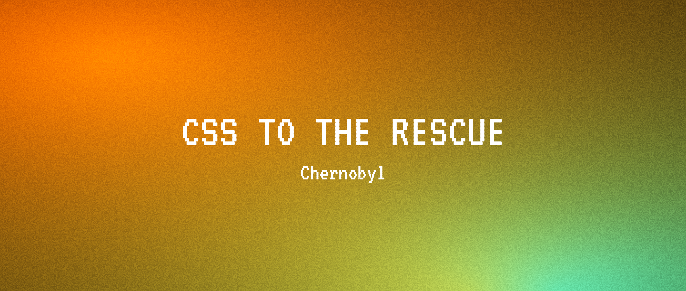
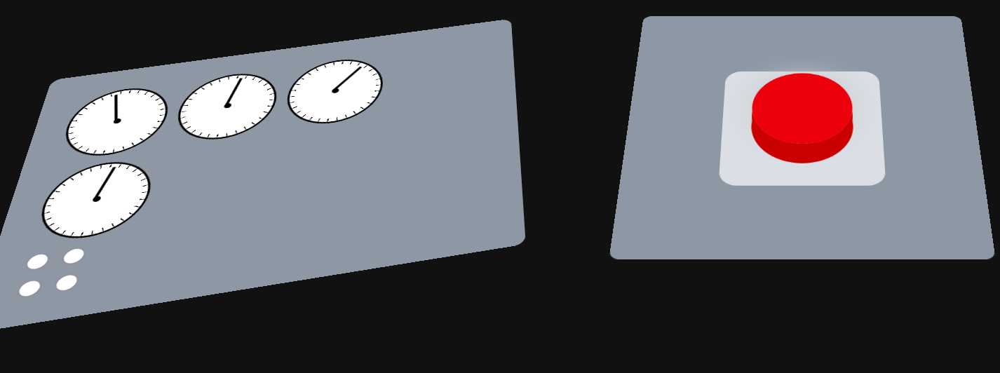
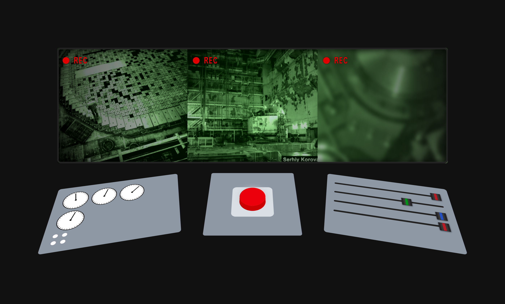

> [!WARNING]
> Momenteel alleen werkend in Chrome en Safari, Firefox volgt later. Gebruik een van deze browsers voor de beste ervaring.


## Leerdoelen bij deze opdracht

- CSS Animaties & Keyframes
    - Ik wil complexe CSS animaties en keyframes kunnen ontwerpen, zodat ik interactieve, duidelijke micro-interacties en state-changes kan bouwen.
    - *Reden: Animaties verbeteren de gebruikerservaring en maken interfaces intuïtiever.*

- Responsive & Semantiek
    - Ik wil een toegankelijke en responsive interface bouwen met semantische HTML, goede contrasten en duidelijke navigatie, zodat mijn projecten bruikbaar zijn op elk device.
    - *Reden: Accessibility en responsiveness zorgen voor inclusieve, gebruiksvriendelijke websites.*

## Week 1

### Dag 1

#### Wat heb ik gedaan vandaag?

| Activiteit | Duur |
|------------|------|
| Geleerd over `@container `| 4 uur |
| Presentatie gemaakt over `@container`| 3 uur |
| Pauze | 1 uur |

#### Wat heb ik geleerd?

* Wanneer `@container` te gebruiken en wanneer @media te gebruiken
* Wat `@container` doet
* Scroll animaties met `@container`
* Styling met `@container`

#### Wat ga ik morgen doen?
- [x] Presentatie geven
- [x] Eerste concept bedenken

### Dag 2

#### Wat heb ik gedaan vandaag?

| Activiteit | Duur |
|------------|------|
| Presentaties gehouden en gegeven| 4 uur |
| Eerste keuzes gemaakt voor eindproject | 3 uur |
| Pauze | 1,5 uur |

#### Wat heb ik geleerd?

* Hoe je anchors plaatst op pop-ups
* Verschillende soorten popovers
* Caroussel gemaakt in native html/css

#### Wat ga ik morgen doen?
- [ ] Groepsgesprek over de 2 projecten

### Week 1 recap (dag 3)

#### Wat heb ik deze week gedaan?

#### Belangrijkste leerpunten

* Het verschil tussen `@container` en `@media` queries en wanneer je welke gebruikt
* Hoe je popovers en anchors in native HTML/CSS implementeert
* Scroll animaties realiseren met `@container` queries
* Een native caroussel bouwen zonder externe frameworks

## Week 2

### Dag 1

#### Wat heb ik gedaan vandaag?

| Activiteit | Duur |
|------------|------|
| Weekly Nerd Nils | 1 uur |
| Basis styling gemaakt | 5 uur |
| Pauze | 1,5 uur |

#### Wat heb ik geleerd?

* Hoe je 3d effecten maakt met box-shadow
* Hoe je een wijzer maakt met clip-path
* Hoe je met perspectief werkt en hoe je schaduwen hierop toepast

#### Wat ga ik morgen doen?
- [ ] Animaties toevoegen aan de wijzer
- [x] Javascript toevoegen om de slider te laten werken

### Dag 2

#### Wat heb ik geleerd?

* Hoe je doormiddel van @property een variabele maakt die je in je css kan gebruiken
* Hoe je deze variabele kan animeren

### Week 2 recap (dag 3)

#### Wat heb ik deze week gedaan?

#### Belangrijkste leerpunten

* 3D effecten creëren met `box-shadow` voor diepte en schaduwwerking
* Een wijzer ontwerpen met `clip-path` en `perspectief` voor realistische weergave
* `@property` gebruiken om CSS-variabelen aan te maken die je direct kunt animeren
* Bij 3D rotaties in CSS zich de rotatie-as automatisch aanpassen aan de transformatie

### Bronnen

- Custom slider styling: [CodePen by Nicolas Jesenberger](https://codepen.io/nicolasjesenberger/pen/VwqzBqj) - aangepast voor dit project

## Week 3 

### Dag 1

| Activiteit | Duur |
|------------|------|
| Custom progress input gemaakt | 4 uur |
| Alles omgezet naar p3 kleurtjes | 0,5 uur |
| De waardes van de sliders rechts gekoppeld aan een animatie | 2 uur |
| Pauze | 1,5 uur |

#### Wat heb ik geleerd?

* Hoe verschillende kleuren werken (p3, hsl en hex)
* Hoe je een progress bar kan stylen en dat een ::after bijvoorbeeld niet werkt op dat element
* Hoe je een slider kan koppelen aan een animatie

#### Wat ga ik morgen doen?
- [ ] De error message dynamisch in laten voegen als je bepaalde dingen doet
- [ ] Radio buttons laten werken
- [ ] Verschillende thema's maken die je kan selecteren (radio button)

### Dag 2

| Activiteit | Duur |
|------------|------|
| Animatie toegevoegd als alle sliders op maximaal staan | 4 uur |
| Stomme wiskunde geleerd | 2 uur |
| Pauze | 1,5 uur |

#### Wat heb ik geleerd?

* Wat sin cas toa is
* Hoe je een animatie kan starten als aan bepaalde voorwaarden wordt voldaan
* Hoe je @container queries kan gebruiken om te checken of sliders op 100 staat

#### Wat ga ik morgen doen?

### Week 3 recap

In de derde week heb ik de visuele basis van het project neergezet en geëxperimenteerd met geavanceerde CSS-technieken voor diepte en beweging.

#### Styling & 3D Effecten
Ik ben begonnen met de basisstyling, waarbij de focus lag op het creëren van een realistische interface. Door middel van `box-shadow`, `clip-path` and `perspectief` heb ik een wijzer en andere elementen ontworpen die een echt 3D-gevoel geven. Een belangrijk leerpunt was hoe de rotatie-as in CSS zich automatisch aanpast bij 3D-transformaties.



#### Techniek & Interactiviteit
Op technisch vlak heb ik de `@property` regel toegepast. Hiermee kon ik aangepaste variabelen maken die direct in CSS te animeren zijn. Daarnaast heb ik JavaScript toegevoegd om de slider functioneel te maken en de eerste animaties aan de wijzer gekoppeld.

```css
@property {

}
```

**[Afbeelding: Het eindresultaat van week 2]**



## Week 4 

### Dag 1

| Activiteit | Duur |
|------------|------|
| Readme verbeterd | 2 uur |

## Bronnen en AI-verantwoording

### Externe bronnen
- CodePen. (n.d.). *Pen VwqzBqj* [CodePen]. https://codepen.io/nicolasjesenberger/pen/VwqzBqj
- Google Fonts. (n.d.). *VT323*. https://fonts.google.com/specimen/VT323
- MDN Web Docs. (n.d.). *@property*. https://developer.mozilla.org/en-US/docs/Web/CSS/@property
- MDN Web Docs. (n.d.). *Container size and style queries*. https://developer.mozilla.org/en-US/docs/Web/CSS/CSS_containment/Container_size_and_style_queries

### AI-gebruik
- GitHub. (2026). *GitHub Copilot* [AI coding assistant]. https://github.com/features/copilot

### Verantwoording AI-gebruik
- GitHub Copilot is gebruikt als ondersteunend hulpmiddel voor.
  - Helpen met code-structuur.
  - Herformuleren van documentatie.
  - Kleine code-ideeën en debughints.
  - Commit messages schrijven.
  